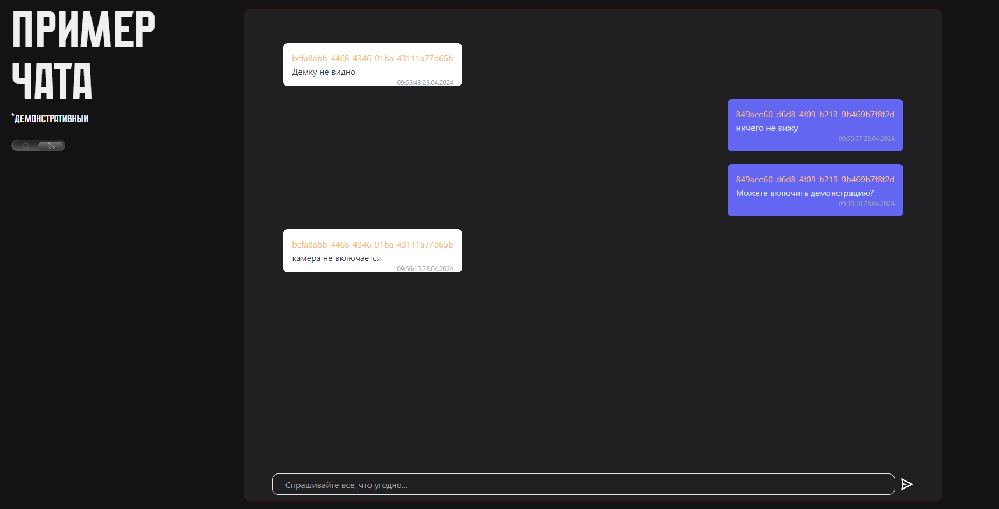

# ЗАГИТ 

### *!!! Загрузка моделей !!!*

[Модель обнаружения проблем](https://disk.yandex.ru/d/0Gj1ppQHqDlsnQ)

### *Доброго времени суток!* **Вашему вниманию** представляется сервис по интеллектуальной обработке сообщений пользователей под названием ЗАГИТ (Защищенная аналитическо-графовая информационная технология).

### Программно-аппаратные требования

* Язык программирования Python >= 3.10
* Видеокарта с поддержкой CUDA (Опционально, для ускорения)
* Nvidia CUDA drivers >= 12.1

### Запуск проекта

#### Backend (FastApi)

В корневой директории **проекта:**

`python -m venv venv`

`venv\Scripts\activate`

Установить зависимости. Проект поддерживает использование пакетного менеджера Poetry:

`pip install poetry`

`poetry install`

Для использования CUDA-ядер, необходимо установить соответсвующую версию torch с cuda

`pip3 install torch torchvision torchaudio --index-url https://download.pytorch.org/whl/cu118`

#### Frontend (Vue3.js)

В директории **frontend,** выполнить команды

`npm install`

`npm run serve`

#### Machine Learning and Data Science (rubert + transformers)

В директории **notebooks** находится файл **research.ipynb**, он содержит информацию по предварительной обработке данных + обучению модели по обнаружению технических неполадок посредством анализа сообщений пользователей.

Установить JupyterNotebook

`pip install notebook`

В той же директории, выполнить

`jyputer-notebook`

В веб-интерфейсе открыть файл с блокнотом

### Математика проекта

#### Предварительная обработка данных

Поскольку в качестве исходных данных был представлен неразмеченный набор данных по сообщениям пользователей, в целях создания модели, работающей в пространстве сообщений обучающихся платформы (также учитывается стилистика сообщений, применение жаргонизмов и неологизмов), небходимо разметить набор данных по интересующим тематикам.

Посредством беглого анализа набора данных были выявлены следующие классификации и категории сообщений:

1. Токсичность (Нейтрально / **С содержанием обсценной лексики, и или угрозы, и или буллинга**)
2. Настроение сообщения (**Положительное** / Нейтральное / **Отрицательное**)
3. Информативное относительно технических неполадок в работе **платформы**
4. Информативное относительно технических неполадок в работе **пользовательских машин**
5. Информативное относительно технических неполадок и или проблем связанных с человеческим фактором (проспал, опоздал, забыл и т.д.) со стороны **преподавателя**

Касаемо 1 и 2 пунктов принято решение об использовании зарекомендовавших себя в сообществе моделей-решений detoxify и rubert-tiny-sentiment, поскольку данные модели обучены на значительно больших объемах наборов данных, а также являются открытыми решениями, что не препятствует их использованию в рамках решения задачи трека.

Пункты 3, 4 и 5 являются уникальными категориями для данного набора данных, следовательно необходимо разметить набор данных под эти категории и в дальнейшем обучить модель по распознаванию этих признаков.

#### Разметка набора данных методикой усовершенствованного алгоритма кластеризации

Как правило, в современных исследованиях аналитики прибегают к алгоритмам кластеризации для определения распределения векторов набора данных в пространстве, как следствие и для понимания количества классов (для задач многоклассовой классификации, к примеру)

Однако это не дает соответсвия между кластером и конкретной выборкой данных, поэтому на основе **косинусного сходства базисных векторов выбранных категорий признаков** мы вывели свой алгоритм разметки данных

Базисным вектором называется в данном случае эталонный экземпляр, относящийся к той или иной категории, например, сообщение

> У меня у одного все зависло???

Является отличным примером информативного вектора по категории неполадок на платформе или на стороне пользователя.

Однако, учитывая зашумленность данных, а также их неоднозначность, пункты 3,4 и 5 на данный момент времени сведены в один пункт "Неисправность в сессии вебинара (занятия)". Для дальнейшего развития и повышения точности определения необходимо больше данных.

#### Обучение модели обнаружения неполадок

В основе проекта модель rubert-tiny, для повышения скорости обработки сообщений пользователей.

Учитывая преобразования, из 121к сообщений только 1,2к оказались информативными, относительно вышеописанных категорий сообщений.

Метрики модели:

* **Accuracy: 0.89**
* **F1_score: 0.87**

#### Предупреждение срывов занятий и повышение оперативности исправления технических неполадок

Обо всех неисправностях администратору приходит сообщение через телеграм-бота

В рамках применения в системах GeekBrains возможно использование любых других способов, поскольку решение функционирует на основе RESTful API

### Перспективы проекта

* Внедрение системы рейтинга вебинаров (занятий)
* Внедрение системы рейтинга преподавателей
* Внедрение системы предупреждения кибербуллинга (через отслеживание UID пользователей и контекста их сообщений)
* Повышение точности, повышение объема данных

### Демонстрация работы

Имитационное моделирование многопользовательского чата какого-либо занятия

Панель администратора. На изображении представлены:

* блок характеристик чата на данный момент времени
* блок мониторинга чата
* блок текущих пользователей (имена захэшированы)
* блок линейных графиков зависимости характеристик чата от времени

